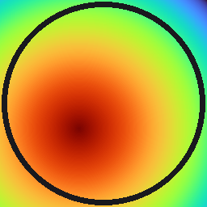

# Condução de Calor 2D — Simulador Didático

Simulador didático de condução de calor bidimensional (regime permanente e
transiente) por diferenças finitas, desenvolvido para uso em aulas de
Fenômenos de Transporte / CFD no DEQ-UEM.

Geometria retangular com dimensões ajustáveis, malha cartesiana ortogonal,
4 tipos de condição de contorno (temperatura prescrita, fluxo prescrito,
convecção, simetria), banco de materiais + material customizado, 4 métodos
de solução (Jacobi, Gauss-Seidel, SOR, direto), e os dois esquemas clássicos
de integração temporal (Euler explícito e implícito).



## Funcionalidades

- **Geometria**: retângulo Lx × Ly, dimensões livres.
- **Material**: Alumínio, Cobre, Ferro, Aço Carbono, Vidro, ou customizado
  (usuário informa ρ, cp, k).
- **Malha**: cartesiana ortogonal, espaçamento uniforme por direção (dx ≠ dy
  permitido), com **pré-visualização obrigatória antes de simular**.
- **Condições de contorno** (independentes em cada uma das 4 faces):
  temperatura prescrita (Dirichlet), fluxo prescrito (Neumann), convecção
  (Robin/Newton), simetria/isolamento.
- **Regime**: permanente ou transiente, com T inicial/chute definida pelo
  usuário.
- **Transiente**: esquema explícito (com cálculo automático do **Δt
  crítico** de estabilidade) ou implícito (incondicionalmente estável),
  ambos Euler de 1ª ordem.
- **Solvers**: Jacobi, Gauss-Seidel, SOR (ω ajustável), ou solver direto
  (`scipy.sparse.linalg.spsolve`).
- **Visualizações**: malha + condições de contorno, campo de temperatura
  (contorno preenchido), fluxo de calor (Lei de Fourier: mapa de |q| +
  vetores), superfície 3D, gráfico de convergência **animado em tempo
  real durante a solução**, e animação do transiente reproduzida no FPS
  escolhido pelo usuário (com play/pause/slider).
- **Exportação**: PNGs de todas as visualizações, CSV do campo de
  temperatura, e GIF do transiente.

## Formulação numérica

Diferenças finitas centradas de 2ª ordem em malha cartesiana uniforme por
direção. As condições de contorno são incorporadas pelo **método do nó
fantasma** (ghost node): em cada face, um nó fictício além do contorno físico
é eliminado algebricamente de forma a satisfazer exatamente a condição de
contorno, preservando a ordem 2 de precisão também nas fronteiras — inclusive
nos cantos, tratados automaticamente pela separabilidade do Laplaciano
(soma independente das contribuições em x e em y).

O passo de tempo crítico do esquema explícito (estabilidade de von Neumann,
esquema FTCS) é:

```
dt_crit = 1 / [ 2·α·(1/dx² + 1/dy²) ]        onde α = k/(ρ·cp)
```

O núcleo numérico (`app/core/`) foi validado contra soluções analíticas:
parede plana 1D (Dirichlet-Dirichlet, erro de máquina), condução-convecção
em série via resistências térmicas (erro de máquina), e estabilidade
incondicional do esquema implícito com Δt até 50× o crítico do explícito.

## Estrutura do projeto

```
heat2d_conducao/
├── main.py                      # ponto de entrada
├── heat2d.spec                  # especificação do PyInstaller
├── requirements.txt
├── app/
│   ├── core/                    # núcleo numérico (independente de GUI)
│   │   ├── materials.py         # banco de materiais
│   │   ├── mesh.py              # malha cartesiana
│   │   ├── bc.py                # condições de contorno
│   │   ├── solver.py            # montagem FD + solvers + Euler exp/imp
│   │   └── visualize.py         # geração de figuras matplotlib
│   └── gui/                     # interface CustomTkinter
│       ├── main_window.py       # janela principal / orquestração
│       ├── painel_entrada.py    # painel de parâmetros de entrada
│       ├── painel_resultados.py # abas de resultados (canvases embutidos)
│       ├── widgets.py           # widgets reutilizáveis (BC, material)
│       └── worker.py            # thread de simulação + fila de progresso
├── assets/
│   └── icon.ico / icon.png
└── .github/workflows/build.yml  # build automático do .exe (Windows)
```

## Rodando a partir do código-fonte

```bash
python -m venv venv
venv\Scripts\activate            # Windows
pip install -r requirements.txt
python main.py
```

## Gerando o executável (.exe)

### Automaticamente (recomendado)

O workflow `.github/workflows/build.yml` compila o `.exe` no Windows
automaticamente sempre que uma tag `vX.Y.Z` é empurrada para o repositório:

```bash
git tag v1.0.0
git push origin v1.0.0
```

O executável fica disponível como artefato da execução do Actions e também
é anexado automaticamente a uma Release do GitHub.

Também é possível disparar o build manualmente pela aba **Actions** do
GitHub (`workflow_dispatch`), sem precisar criar uma tag.

### Localmente (Windows)

```bash
pip install -r requirements.txt pyinstaller
pyinstaller heat2d.spec --noconfirm
```

O executável é gerado em `dist/Conducao2D_DEQ-UEM.exe` — arquivo único,
sem necessidade de instalação, sem console.

## Limitações conhecidas (versão atual)

- Material homogêneo (k, ρ, cp constantes no domínio) — sem multi-região.
- Sem termo de geração de calor interna (fonte volumétrica).
- Cantos com condições de Dirichlet conflitantes entre as duas faces
  adjacentes usam prioridade esquerda > direita > inferior > superior
  (aviso impresso no console).
- O gradiente para o pós-processamento do fluxo de calor usa
  `numpy.gradient` (2ª ordem no interior); em cantos com BCs mistas
  (ex.: Dirichlet + convecção) é esperado um "hot spot" no fluxo — é uma
  singularidade física real de canto, não um erro numérico.

## Autor / contexto

Desenvolvido como material didático para a disciplina de CFD / LEQ III,
Departamento de Engenharia Química — Universidade Estadual de Maringá
(DEQ-UEM).
